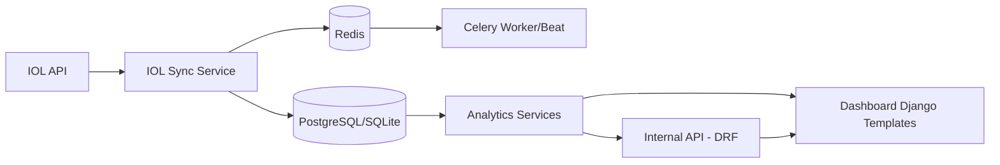

# Diagrama de Arquitectura

## Componentes
- `IOL API`: fuente externa de datos operativos.
- `IOL Sync Service`: sincronizacion de cuentas, portafolio y operaciones.
- `Database`: snapshots y metadata persistente.
- `Analytics Services`: riesgo, performance, attribution, liquidez, calidad de datos.
- `Internal API`: expone metrica y capacidades para UI y consumo interno.
- `Dashboard`: visualizacion de KPIs, alertas y soporte de decisiones.
